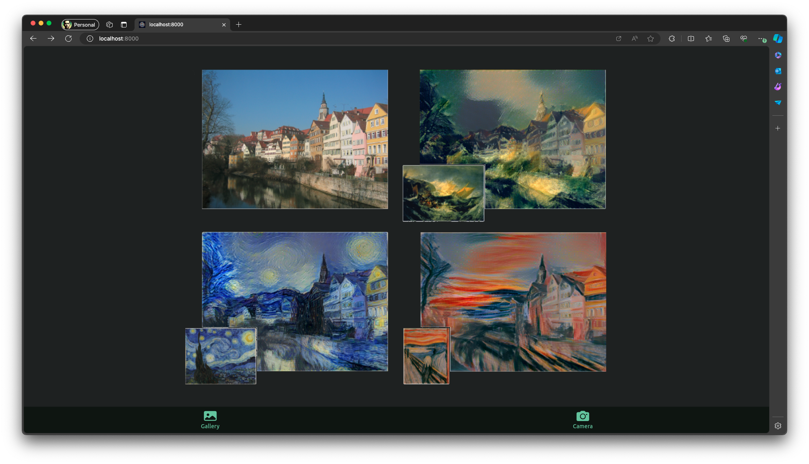
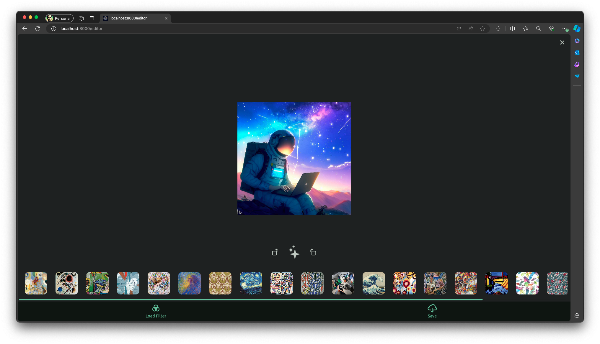
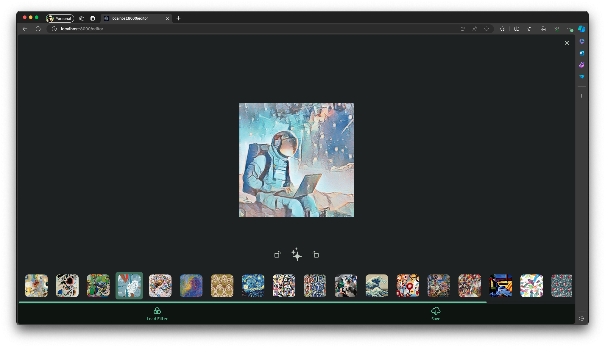
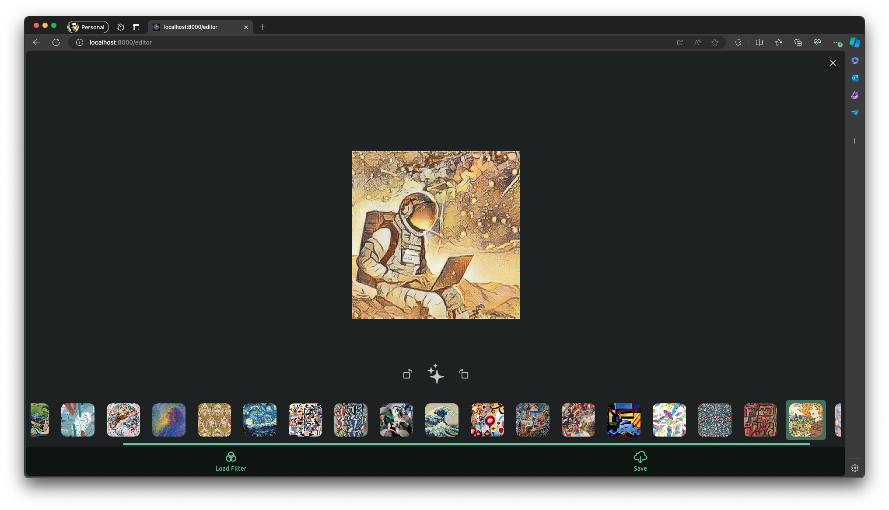

# Style Transfer

Style Transfer is an application developed with Flutter that allows users to apply artistic style transformations to images using advanced style transfer models created by Google, as described in their publication [Supercharging Style Transfer](https://research.google/blog/supercharging-style-transfer/).

## Technical Features

* **Local Inference on Mobile**: In the mobile versions, TensorFlow Lite is used to load the models and perform inference directly on the device. This ensures fast performance and does not rely on an internet connection.

* **Isolates on Mobile**: To avoid blocking the main thread responsible for rendering the user interface (UI), inference and image processing are performed in the background using isolates. This enhances the user experience by keeping the UI responsive.

* **Server-side Inference for Web**: In the web version, inference is handled by sending requests to a server running FastAPI and using TensorFlow to execute the models.

* **Web Workers on Web**: Similar to isolates in the mobile versions, web workers are used in the web version to perform inference and image processing in the background, ensuring the UI remains smooth and responsive.

## Screenshots

### Web
|  |  |
| --- | --- |
|  |  | 
 |  |

### Mobile

|  |  |
| --- | --- |
|  |  |
|  |  |


## Local deployment using Docker Compose

```bash
docker compose up
```

## Build for web

### Setup service workers api url

```bash
./build_service_workers.sh http://localhost:8080
```

### Build web

```bash
flutter build web
```

### Run local API

Download tensorflow lite models to root folder

```bash
curl https://storage.googleapis.com/download.tensorflow.org/models/tflite/task_library/style_transfer/android/magenta_arbitrary-image-stylization-v1-256_int8_prediction_1.tflite -o magenta_arbitrary-image-stylization-v1-256_int8_prediction_1.tflite

curl https://storage.googleapis.com/download.tensorflow.org/models/tflite/task_library/style_transfer/android/magenta_arbitrary-image-stylization-v1-256_int8_transfer_1.tflite -o magenta_arbitrary-image-stylization-v1-256_int8_transfer_1.tflite
```

```bash
python -m venv venv
```

```bash
source venv/bin/activate
```

```bash
pip install -r requirements.txt
```

```bash
uvicorn tflite_server:app --host 0.0.0.0 --port 8080
```

## Build for android

### Download tensorflow lite models to assets folder

```bash
curl https://storage.googleapis.com/download.tensorflow.org/models/tflite/task_library/style_transfer/android/magenta_arbitrary-image-stylization-v1-256_int8_prediction_1.tflite -o assets/models/magenta_arbitrary-image-stylization-v1-256_int8_prediction_1.tflite

curl https://storage.googleapis.com/download.tensorflow.org/models/tflite/task_library/style_transfer/android/magenta_arbitrary-image-stylization-v1-256_int8_transfer_1.tflite -o assets/models/magenta_arbitrary-image-stylization-v1-256_int8_transfer_1.tflite
```

### Build

```bash
flutter build apk
```

## Build for iOS (Development)

You need to have a macOS device with Xcode to build for iOS.

### Download tensorflow lite models to assets folder

```bash
curl https://storage.googleapis.com/download.tensorflow.org/models/tflite/task_library/style_transfer/android/magenta_arbitrary-image-stylization-v1-256_int8_prediction_1.tflite -o assets/models/magenta_arbitrary-image-stylization-v1-256_int8_prediction_1.tflite

curl https://storage.googleapis.com/download.tensorflow.org/models/tflite/task_library/style_transfer/android/magenta_arbitrary-image-stylization-v1-256_int8_transfer_1.tflite -o assets/models/magenta_arbitrary-image-stylization-v1-256_int8_transfer_1.tflite
```
### Build

```bash
flutter build ios
```

```bash
flutter install
```

Follow the instructions to run the app on your iOS device.

For more information, see the [iOS | Flutter documentation](https://docs.flutter.dev/deployment/ios).
